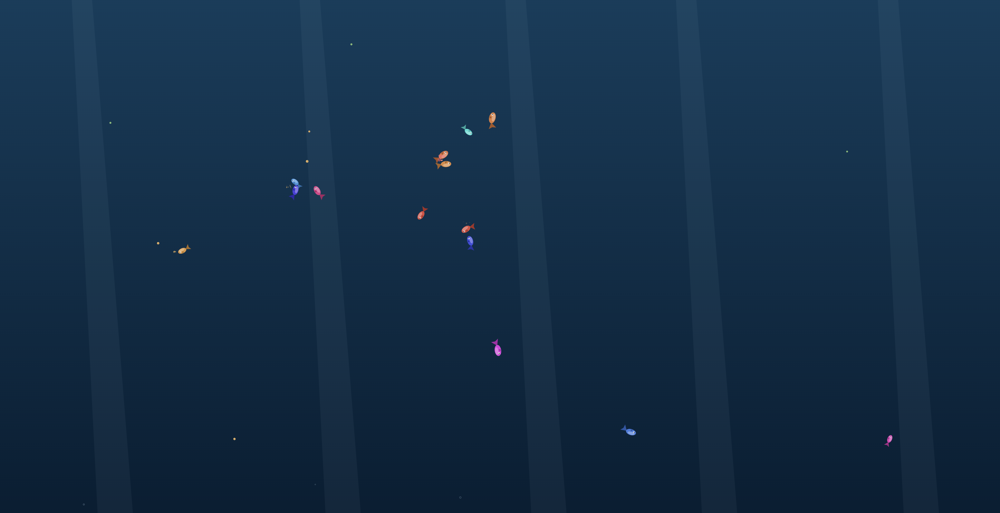
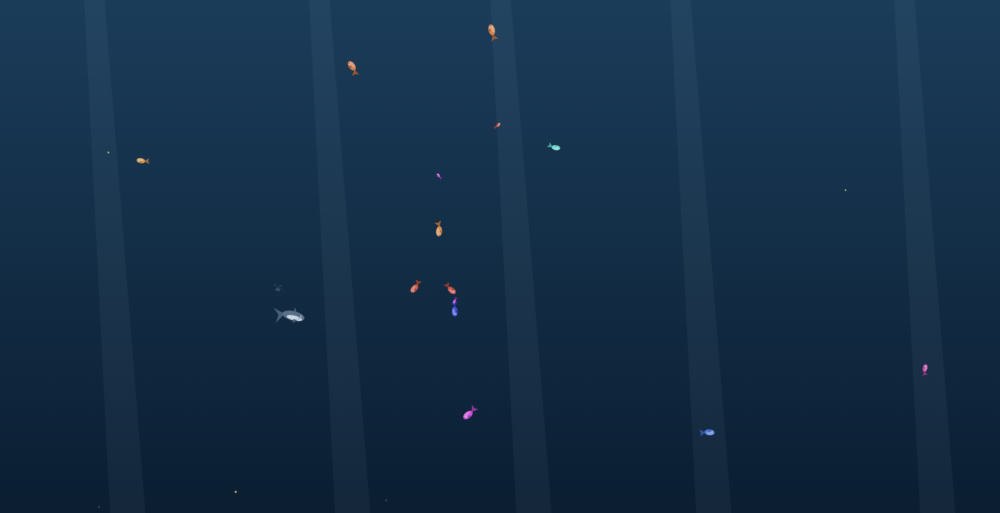

# 桌面鱼塘 🐟 desktop-aquarium

> 把屏幕变成鱼缸：透明覆盖在桌面上的养鱼桌宠。鱼会繁殖、会躲你的鼠标、饿了啃浮游生物，还能右键放鲨鱼清场。
> A transparent desktop-overlay fish tank pet. Fish breed, flee your cursor, graze plankton, and get culled by sharks you summon.



## 特色

- **真·桌面覆盖**：透明、无边框、置顶窗口，鱼直接游在你的窗口和壁纸上
- **默认鼠标穿透**：完全不影响正常操作；但鱼依然会被你划过的鼠标吓跑（主进程轮询全局坐标实现，零权限要求）
- **自平衡生态**：不喂也饿不死（啃浮游生物保底），喂饱了才繁殖；自然浮游 flakes 维持种群；寿命更替；全灭自动补鱼
- **繁殖与遗传**：小鱼的颜色/体型/速度遗传父母并带变异，22 秒长大
- **鲨鱼天敌**：吃 3~5 条后从屏幕边缘游走，是控制种群的手段
- **多显示器**：每台显示器一个独立鱼缸（各自正确的 DPI/边界），统计自动汇总
- **菜单栏统计**：macOS 右上角托盘图标旁实时显示 `鱼24 · 生7 · 亡3`



## 三个版本

| 目录 | 技术栈 | 说明 |
|------|--------|------|
| `desktop-aquarium-tauri/` | **Tauri v2**（Rust + 系统 WebView） | 主推。安装包几 MB，托盘 + 全局快捷键 |
| `desktop-aquarium-app/` | Electron | 同一套渲染层，备选方案 |
| `desktop-aquarium/` | 纯 HTML 单文件 | 浏览器打开即玩（带水底背景），零依赖 |

三个版本共用同一套 Canvas 渲染/生态代码，通过 `window.aquarium` 桥接层对接各自宿主。

## 运行

### Tauri 版（推荐）

```bash
cd desktop-aquarium-tauri
npm install
npm run dev        # 开发模式
npm run build      # 打包 .app / .exe / .AppImage
```

需要 Rust 工具链（`rustup`）。macOS 上 `cargo` 不在 PATH 时：`PATH="$HOME/.cargo/bin:$PATH" npm run dev`。

### Electron 版

```bash
cd desktop-aquarium-app
npm install
npm start
```

### 纯网页版

直接用浏览器打开 `desktop-aquarium/index.html`。

## 交互

| 操作 | 效果 |
|------|------|
| 移动鼠标 | 附近的鱼四散逃窜（穿透模式下也有效） |
| `Ctrl/⌘ + Alt + D` / 托盘「撒鱼食」 | 在鼠标位置撒鱼食 |
| `Ctrl/⌘ + Alt + X` / 托盘「召唤鲨鱼」 | 鲨鱼从最近屏幕边缘入场，吃几条后游走 |
| `Ctrl/⌘ + Alt + F` | 进入/退出交互模式（交互模式下可直接点击喂食、右键召鲨，`Esc` 退出） |
| `Ctrl/⌘ + Alt + P` | 暂停 / 继续 |

纯网页版：左键撒食（按住拖动连发）、右键召鲨、空格暂停。

## 生态参数（renderer 里 `CFG` 可调）

- 种群软上限 42 条（超过停止繁殖），硬上限 80
- 饱食度 ≤45 时啃浮游生物保底（饿不死），>60 才能繁殖
- 自然浮游 flakes 每 18~30 秒飘落一波，不喂也能少量繁殖
- 寿命 200~300 秒自然更替；全灭 20 秒后自动补 5 条

## 实现要点

- **透明覆盖窗**：Tauri `transparent + decorations:false + alwaysOnTop + skipTaskbar`；macOS 必须开 `macOSPrivateApi`（config + cargo feature 双开）否则白底
- **鼠标穿透**：`set_ignore_cursor_events(true)`；鱼感知鼠标靠主进程 30Hz 轮询 `NSEvent.mouseLocation` 广播（不要用 `device_query` crate，macOS 上无辅助功能权限会直接 panic）
- **多屏**：每屏一个窗口，URL query 注入逻辑原点（`?ox=&oy=&label=`），全局坐标各窗口自行换算并忽略视口外事件
- **均匀分布**：贴边才强力推开 + 全时段距离平方级向中心牵引（防止"贴墙巡游"扎堆角落）

## License

MIT
